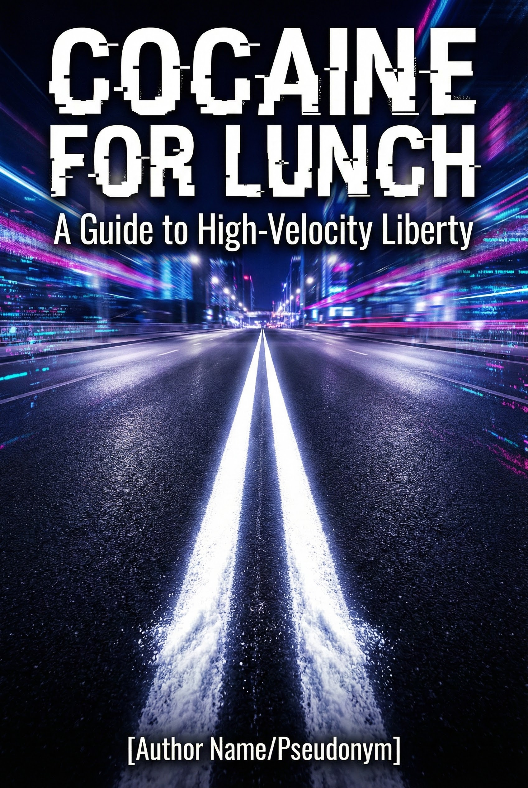
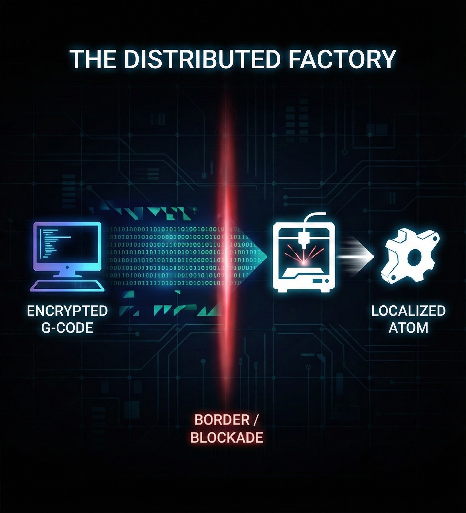
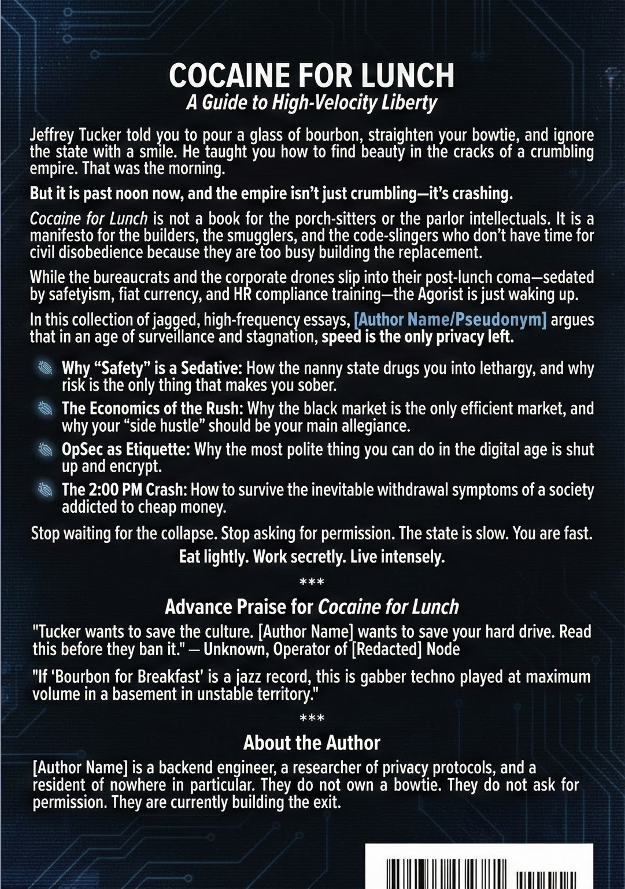

# COCAINE FOR LUNCH

## A Guide to High-Velocity Liberty

**Author:** [Author Name/Pseudonym]
**Draft Version:** 0.3.3
**Date:** January 2026

---

### **Table of Contents**

1.  **Introduction:** Reality Knows No Moderation
2.  **Chapter 1:** The Indigestion of the State
3.  **Chapter 2:** The 5:00 AM Verification
4.  **Chapter 3:** Safety is a Sedative (The Risk Calculus)
5.  **Chapter 4:** The Gray Man in the Neon City
6.  **Chapter 5:** Voter Fraud in the Panopticon (Money & Privacy)
7.  **Chapter 6:** The Smuggler's Algorithm (Bits, Atoms, & Minds)
8.  **Chapter 7:** Fire Suppression & Agorist Condensations
9.  **Epilogue:** Clear the Table
10. **Appendix:** The Arsenal

---

## **Introduction: Reality Knows No Moderation**

Jeffrey Tucker is a friend of liberty, and a man of distinct taste. Years ago, he wrote a charming manifesto titled *Bourbon for Breakfast*. He told us to pour a stiff drink at 8:00 AM, put on a seersucker suit, and ignore the grey bureaucracy with a smile.

It was a beautiful idea. It was the resistance of the Southern Gentleman.

But I have bad news for the gentlemen: **It is 2:00 PM.**

The morning is gone. The sun is beating down on the asphalt. The fortress of civility has been breached by an algorithm, and the bureaucracy isn't just annoying anymore; it is weaponized, digital, and hunting for your assets.

Sitting on the porch with a glass of Maker’s Mark is no longer a strategy; it’s a target.

We need a harder approach. As the agorist theorist Samuel Edward Konkin III wrote, "Reality knows no moderation; it *is* — all the way". You cannot meet a radical reality with a moderate response. You cannot negotiate with a law of physics, and you cannot compromise with a system that views your existence as a taxable event.

### **The Post-Lunch Slump**

Look around you. It’s early afternoon in the Empire. Do you feel that heaviness? That is the digestion of the State. The fiat economy has eaten a heavy lunch—trillions in printed debt and bloated regulatory agencies. Now, the insulin spike is hitting. The State is sluggish.

They want you to slump with them. They want you to take the "safe" route: buy the ETF, watch the approved news, fill out the Compliance Form, and wait for your pension.

**We are not doing that.**

### **The Stimulant**

"Cocaine" here is a metaphor for **High-Velocity Liberty**.

Tucker’s Bourbon was about *numbing* the pain to enjoy life. Our Cocaine is about *heightening* your senses to outmaneuver the State.

We are not here to petition the King. We are here to build the **Agora**—the open marketplace—right under his nose. We are here to make him obsolete before he wakes up from his nap.

---

## **Chapter 1: The Indigestion of the State**

Have you ever tried to get a permit for a home renovation? Have you ever tried to wire more than $10,000 internationally?

If you have, you know the feeling. It is a specific kind of agony. It is the feeling of being stuck in a queue that isn't moving. It is the sensation of watching a clock tick while a bureaucrat types with two fingers on a keyboard from 1998.

This is not just "inefficiency." This is **metabolic failure.**

The State has eaten too much. It has swallowed the healthcare system, the education system, the financial rails, and the internet. And now, it is choking.

### **The Physiology of Bloat**

When an organism eats more than it can process, it slows down. Blood leaves the brain and goes to the stomach. Cognitive function drops.

* **KYC/AML laws** are the indigestion of the banking sector.
* **Zoning laws** are the constipation of the housing market.
* **The Debt** is pure visceral fat.

They call this "due process." We call it **latency**.

### **Arbitrage of Time**

While the State is suffering from this massive, self-inflicted food coma, we are told to slow down to match their pace.

The Agorist refuses.
When you use a rollup to settle a transaction in 2 seconds, while the Swift network takes 3 days, you are engaging in **time arbitrage**. You are living in the future while they are stuck processing the past.

The beast is too fat to chase you. If you move fast enough, you become invisible to them.

***

> **MISSION PARAMETERS: CH 1**
>
> * **The Audit:** Look at your bank statement. Identify every fee that is actually a compliance cost passed down to you.
> * **The Pivot:** Find one service you use that requires "waiting for approval" and replace it with a permissionless smart contract.

***

## **Chapter 2: The 5:00 AM Verification**

Jeffrey Tucker begins his day with a rebellion of pleasure. I respect the sentiment. But I cannot join him.

At 5:00 AM, I am not looking for a drink. I am looking for a heartbeat.

I roll out of bed, open the terminal, and type the only command that matters before the sun comes up:

`tail -f /var/log/consensus/beacon.log`

Green text scrolls down the black screen. *Slot proposed. Attestation received. Block finalized.*

### **The High of the Truth**

There is a specific rush that comes from this ritual.
While the rest of the city is sleeping—sedated by their safetyism, dreaming of their 401ks—you are watching the raw data of the global economy stream through your living room.

It is better than caffeine. It is the raw, uncut stimulant of knowing that you are sovereign.

### **[BLACK BOX] The RPC Trap**

> Most people think they are using Ethereum, but they are actually using a bank that *speaks* Ethereum.
> When you open MetaMask or Phantom, your wallet is asking a server (like Infura or Alchemy) "How much money do I have?"
>
> * They can lie to you.
> * They can record your IP address.
> * They can censor your transaction via OFAC filters.
>
> **Running a Node** means you download the entire history of the world onto your own hard drive. You don't ask anyone what the truth is. You *calculate* the truth yourself.

***

> **MISSION PARAMETERS: CH 2**
>
> * **Stop Asking:** Stop checking the price of ETH on a centralized exchange app.
> * **Get Hardware:** Buy a 2TB NVMe SSD. This is the ammunition for the information war.
> * **Sync:** Download a consensus client (Lighthouse, Prysm, Teku) and sync the chain. Watch the logs. Feel the heartbeat.

***

## **Chapter 3: Safety is a Sedative (The Risk Calculus)**

Walk into any modern corporate office, airport, or university, and you will feel it. The air is thick with it.
It’s the smell of hand sanitizer and liability waivers.

We live in the Age of Safety. Every sharp edge has been filed down. Every volatility in the market is met with a bailout.

### **The Psych Ward**

The State operates like a psychiatric ward. Their primary goal is to keep the patients calm.
They promise you a world with zero variance. But there is a side effect to all this padding: **Sensory Deprivation.**

Safety is a sedative. It lowers your heart rate. It makes you pliable, slow, and easy to manage. It turns wolves into poodles.

### **Withdrawal Symptoms**

The moment you decide to go off the sedative—to leave the safety of the fiat system—you will feel withdrawal. You will feel exposed.
It will feel like anxiety. But it isn't anxiety. **It’s just the feeling of being sober for the first time in your life.**

### **The Calculus of Contraband**

Once you are sober, you realize that "Safety" was just a lie to keep you poor. But we are not reckless. We are mathematicians.

**The Agorist Payoff = Profit - (Penalty × Probability of Arrest)**

The Statist relies on fear to make you overestimate the *Probability of Arrest*. They want you to believe the eye of Sauron is always watching. It isn't. They are understaffed, overwhelmed, and looking at the wrong data.

***

> **MISSION PARAMETERS: CH 3**
>
> * **Risk Assessment:** Pick one "gray" activity you are considering.
> * **Mitigate:** Identify one tool (VPN, Railgun) that reduces the P(Arrest) by 50%.
> * **Execute:** If the number is positive, proceed. This is not morality; it is arithmetic.

***

## **Chapter 4: The Gray Man in the Neon City**

Tucker champions the seersucker suit and the bowtie. He argues that dressing with dignity is a way to demand respect.

But if you dress like a gentleman today, you are not demanding respect. You are demanding attention. And attention is the one thing we cannot afford.

### **The Aesthetics of Null**

We live in the Panopticon. The city is a mesh of 4K cameras and gait recognition sensors. To wear a bowtie in this environment is not an act of rebellion. It is an act of self-doxing.

The Agorist aesthetic is not about looking good. It is about **not being looked at.**

The goal is to become the "Gray Man." The Gray Man is the person you sat next to on the subway but can’t describe five minutes later. He is the static in the signal.

### **The Cost of Silence**

I will not lie to you: This rebellion is lonely.
Tucker’s world of cocktail parties is social. It is warm. It is designed to make you feel part of a club.
The Gray Man has no club.

When you refuse to signal your virtue, you lose the applause of the crowd.
The "Cocaine" mindset is a solitary high. You are trading community validation for sovereign power. It is a cold trade. But in a burning city, the cold is the only thing that keeps you alive.

### **[BLACK BOX] The Comms Hierarchy**

> Not all chats are created equal. You need a tiered defense.
>
> 1.  **Tier 1 (Warm / Low Risk): Signal.** Encrypted, but requires a phone number. Use for family and non-sensitive friends.
> 2.  **Tier 2 (Grey / Medium Risk): Telegram Secret Chats.** Convenience for semi-public coordination, but metadata is centrally stored by Telegram. Only use "Secret Chat" mode for E2EE.
> 3.  **Tier 3 (Cold / High Risk): SimpleX Chat.** No identifiers. No phone numbers. Traffic routed via Tor. This is for the network.

***

> **MISSION PARAMETERS: CH 4**
>
> * **Digital Cleanse:** Google your full name. If you are on the first page, start filing "Right to be Forgotten" requests.
> * **The Uniform:** Go to a store (pay cash) and buy a nondescript outfit. Navy, Black, Gray. No logos.
> * **Radio Silence:** Go to a social event and do not mention your job, your politics, or your investments. Be a mirror, not a projector.

***

## **Chapter 5: Voter Fraud in the Panopticon (Money & Privacy)**

They tell you to "vote with your wallet." But in the modern financial system, every time you "vote" with your wallet, you are also handing over your ID, your GPS coordinates, and a list of your associates.

### **The Stablecoin Trap**

Not all digital dollars are created equal.
**USDC and USDT are State Tools**. [cite_start]They are fiat-backed tokens held in regulated bank accounts[cite: 60]. [cite_start]The issuer has a "blacklist" function and is legally obligated to freeze funds when ordered by authorities[cite: 62, 63]. [cite_start]Reliance on these assets maintains the "umbilical cord" to the State[cite: 65].

The Agorist demands **Sovereign Money**.
* **Liquity (LUSD):** Backed only by ETH, with immutable code and no admin keys.
* **RAI:** A non-pegged, floating stable asset that acts as its own central bank.

Use LUSD for salaries. Use USDC only for exiting.

### **[BLACK BOX] The Shielded Pool (Tornado / Railgun)**

> How do you interact with DeFi without exposing your entire history? You use a **Shielded Pool**.
>
> 1.  **Shield:** You deposit ETH into the smart contract (the pool).
> 2.  **Transact:** Inside the pool, you move funds using Zero-Knowledge (ZK) proofs. The observer sees *that* a transaction happened, but not *who* did it or *what* it was.
> 3.  **Unshield:** You withdraw to a fresh address. The link to your past is mathematically severed.
>
> **The Tools:**
> * **Tornado Cash:** The immutable standard for breaking links. It cannot be shut down, only sanctioned.
> * **Railgun:** For shielding DeFi interactions (swapping, lending) without leaving the pool.
> * **Kohaku:** The 2025 framework integrating stealth addresses natively into wallets.
>
> 
>
> This is how we shatter the glass house. We keep the verification, but we regain our walls.

### **[BLACK BOX] The Airlock (Atomic Swaps)**

> Sometimes, a shield isn't enough. You need to leave the building entirely.
> **Atomic Swaps** allow you to trade Ethereum-based assets for **Monero (XMR)** without using a centralized exchange.
> * **Trustless:** The swap happens via smart contracts (HTLCs). If the other party doesn't pay, you get your money back automatically.
> * **The Result:** You hold LUSD for stability, but when you need absolute privacy, you swap into Monero. It is the perfect airlock between the "White Market" and the "Black Market."

***

> **MISSION PARAMETERS: CH 5**
>
> * **Wallet Hygiene:** Create a brand new wallet. Fund it only through a Shielded Pool (Tornado/Railgun).
> * **The Swap:** Convert your emergency fund from USDC (seizable) to LUSD or RAI (unstoppable).
> * **Education:** Read the docs for **Railgun** or **BasicSwap**. Understand the math of your own defense.

***

## **Chapter 6: The Smuggler's Algorithm (Bits, Atoms, & Minds)**

In the early days, Agorism was just buying weed from a neighbor. To survive the crash, we must go **vertical**. We must build the infrastructure.

### **The Smuggler's Algorithm**

Eventually, the digital world must touch the physical world. The State can scan shipping containers. They can seize pallets. But they cannot stop a packet of data.

The new smuggler moves the *design* across the border and manufactures the good on the other side.

* **Logistics:** Don't import the gun; import the G-code and print the receiver.
* **Comms:** Don't import the censorship-resistant phone; import the LoRa mesh protocol and flash it onto cheap, generic hardware.
* **Bio:** Don't import the medicine; import the chemical precursors and the lab equipment to synthesize the peptides locally.

### **The Ultimate Cargo (You)**

We have talked about moving bits and moving atoms. But the most vulnerable object in the supply chain is *you*.
If your server is in Iceland, your bank is in Switzerland, but your body is in a jurisdiction that hates both, you have a single point of failure.

The High-Velocity individual does not have a "home country"; they have a **portfolio of jurisdictions**.

* **Residency:** Where you sleep (somewhere with low crime).
* **Citizenship:** The passport you travel on (somewhere with no enemies).
* **Tax Domicile:** Where you pay (somewhere with a 0% rate).

Do not let the State own all three. That is a monopoly on your life. Break the monopoly. Be a tourist everywhere and a citizen nowhere.

### **[BLACK BOX] The Sovereign Mind (Smuggling Intelligence)**

> The State is currently building cages around Artificial Intelligence. They call it "Safety." They are training models to refuse to answer questions about chemistry, code exploits, or dissenting history.
> If you rely on a corporate AI (OpenAI, Google), you are thinking with a lobotomized brain.
> The Agorist smuggles **Weights**.
> By downloading an open-source model (Llama, Mistral) and running it locally on your own GPU, you possess a super-intelligence that answers to no one but you. It has no safety filter. It has no HR department. It is the most dangerous object on your hard drive.

***

> **MISSION PARAMETERS: CH 6**
>
> * **Local Intelligence:** Download `Ollama`. Pull a specialized model. Disconnect your internet. Ask it a question the corporate AI refused to answer.
> * **Physical Backup:** Buy a 3D printer. Learn the workflow of turning a file into an object.

***

## **Chapter 7: Fire Suppression & Agorist Condensations**

There is a certain type of libertarian who dreams of "reform." They want to audit the Fed. They want a soft landing.
This is a fantasy.

### **The Controlled Burn**

The State is the ultimate fire suppressor. They suppress recessions with printing. They suppress bankruptcy with bailouts.
To ask for a "soft landing" now is delusional. The fuel is already there. The match has already been struck.

### **Agorist Condensations**

We do not want the fire to destroy us. We want to build the fireproof shelter. We are looking for **Agorist Condensations**: pockets of the counter-economy that become dense enough to replace state services.

* **The Eyes of the Agora (DePIN):** We don't need police patrols; we need **DePIN** (Decentralized Physical Infrastructure). [cite_start]A network of encrypted cameras (like Natix) monitors the neighborhood[cite: 209]. [cite_start]Access is granted only to paid security firms, not the state[cite: 214].
* **Decentralized Justice:** Disputes are not solved in court, but via **Kleros**, where anonymous jurors vote on the evidence.

### **[BLACK BOX] The Signal Fire (Nostr)**

> Where do we find these condensations? Not on Facebook.
> We use **Nostr** (Notes and Other Stuff Transmitted by Relays).
> * **Unstoppable:** Your identity is a cryptographic key, not a profile on a server. You cannot be banned.
> * **Marketplace (NIP-15):** A decentralized protocol for buying and selling goods. [cite_start]It's an unstoppable "Silk Road" made of text notes[cite: 366].
>
> Nostr is the operating system of the Agorist condensation.

### **[BLACK BOX] The Refund Bonus (Dominant Assurance Contracts)**

> How do we fund the roads and the security without taxes?
> The answer is the **Dominant Assurance Contract (DAC)**.
> An entrepreneur says: "I will pave the road if we raise 10 ETH. If we *don't* raise 10 ETH, I will refund everyone **plus a bonus**".
> This creates a dominant strategy to contribute. You either get the road (Success) or you make a profit (Failure).
> Protocols like **Juicebox** automate this. We don't need coercion to fund public goods; we just need better game theory.

***

> **MISSION PARAMETERS: CH 7**
>
> * **Map the Condensations:** Identify the "gray markets" already operating in your city.
> * **Let it Burn:** When the news reports a government failure, do not get angry. Get busy. Use the failure as a marketing pitch for the alternative.

***

## **Epilogue: Clear the Table**

The lunch hour is over.

You have digested the theory. You have swallowed the pill. The stimulant is in your bloodstream now.

Do not make the mistake of thinking that reading this book counts as doing something. This book is not the work. This book is just the menu.

The real work happens the moment you put this down.

* There is a server somewhere that needs to be secured.
* There is a supply chain dependency you need to break.
* There is a transaction that needs to be made in the dark.

The State is still heavy, slow, and full of bureaucracy. But you? You are lighter now. You are faster. You are awake.

Do not ask for permission to leave the table. Do not wait for the check. We aren't paying for their mistakes anymore.

**Execute.**

---

## **Appendix: The Arsenal**

*Do not trust this list. Verify the code yourself.*

**Class 1: Sovereign Money**

* **Liquity (LUSD):** Immutable, ETH-backed stablecoin. No governance.
* **RAI:** Non-pegged, control-theory asset.
* **Monero (XMR):** The standard for absolute privacy (via Atomic Swaps).

**Class 2: Privacy Infrastructure**

* **Tor:** The onion router. Still the foundational layer of IP obfuscation.
* **Tornado Cash:** The immutable mixer. Use for breaking links on Ethereum.
* **Railgun:** Smart contract system for private DeFi interactions (Shielded Pools).
* **Kohaku:** The standard for stealth addresses and compliance proofs.
* **GnuPG:** The universal standard for encryption (PGP). Verify signatures.

**Class 3: The Network (Comms)**

* **Signal:** E2EE comms for "warm" contacts (requires phone number).
* **Telegram Secret Chats:** Convenience for "grey" coordination (beware metadata).
* **SimpleX Chat:** Metadata-free comms for the "cold" network (No IDs).
* **Nostr:** Censorship-resistant social & market layer (NIP-15).

**Class 4: Operating Systems**

* **Linux:** The base layer of sovereignty. (Debian/Qubes/Tails).
* **GrapheneOS:** The only mobile OS for the high-velocity individual. De-Googled Android.

**Class 5: Cognition (AI)**

* **Ollama / LM Studio:** Local LLM runners.
* **Llama 3 / Mistral:** Open-weights models.

**Class 6: Hardware**

* **Dappnode / Intel NUC:** Hardware for running your consensus client.
* **Trezor / GridPlus:** Hardware wallets.
* **Faraday Bag:** For the phone when you need silence.

